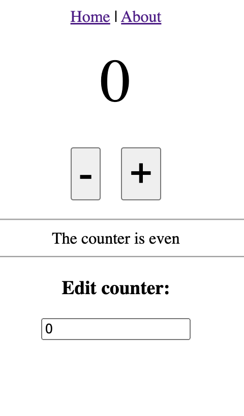

# Counter App with Pinia

This is just a very simple counter app for demonstrating use of Pinia state management using setup (as opposed to options)


## Project Setup

```sh
npm install
```

### Compile and Hot-Reload for Development

```sh
npm run dev
```

### Type-Check, Compile and Minify for Production

```sh
npm run build
```
